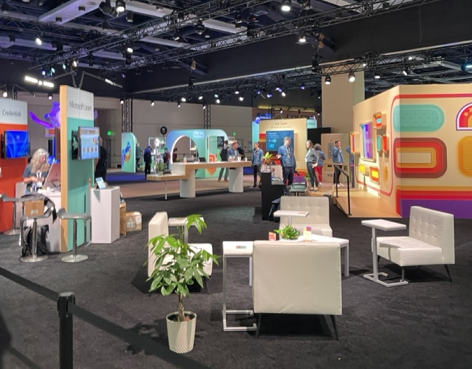

# Microsoft Build 2025

## Keynote Notes

- **AI Evolution:** Developers increasingly leverage AI for code assistance and application building using Agents and MCP servers. Most of the keynote and Build events were revolving around **Agents**, workflows, **MCP** and its improvements.

- **Industry Collaboration:** Tech leaders Sam Altman (OpenAI), Elon Musk (xAI/Tesla), and Jensen Huang (Nvidia) are joining forces with Microsoft to accelerate the development of advanced AI systems.

- **Multi-Agent Workflows:** Developers can now orchestrate multiple specialized agents to handle complex tasks and accelerate decision-making.

- **Cross-sector AI Application:** Healthcare, gaming, and business software benefit significantly from AI-driven task automation and efficiency improvements.

- **Microsoft 365 Copilot:** Enhances productivity by integrating AI into familiar applications like Word and Excel, aiding in content creation and data analysis.

- **WebVTT and Interaction Tools:** Improved interfaces and interactions for managing complex data effectively.

- **AI in Software Development:** Enhanced predictive coding, debugging efficiency, and faster testing through AI integration.

- **GitHub Copilot Upgrades for .NET and Java:** Automates and simplifies the version upgrade process, creating comprehensive upgrade plans, enhancing performance, addressing security vulnerabilities, and reducing technical debt.

- **New SRE Agent:** Reduces operational costs and enhances application uptime through automated alert responses, issue mitigation, root cause analysis, and proactive health monitoring, notably reducing incident resolution times.

- **GitHub Models:** Brings top Azure AI Foundry models into GitHub with native integration. Developers can easily evaluate, prototype, and deploy AI models as part of their standard GitHub workflows (pull requests, code reviews, CI/CD).

- **GitHub Copilot Coding Agent:** Developers can now assign Copilot a range of coding tasks—like refactoring, improving tests, fixing bugs, and implementing features. You can add issues directly to Copilot, making it an active team member that collaborates on complex work and helps automate routine development tasks. (Currently in preview)

- **GitHub Copilot for PostgreSQL in VS Code:** New extension (in preview) brings Copilot AI assistance and database context for PostgreSQL directly into VS Code, enabling natural language interaction, real-time expert SQL help, schema design, and best practices—boosting developer productivity for GenAI apps, without extra setup or AI subscription costs.

- **Azure Cobalt VMs**: Microsoft’s new generation of virtual machines powered by custom Azure Cobalt CPUs, delivering high performance, cost efficiency, and scalability for enterprise workloads.

- **Microsoft 365 Copilot Tuning and Agent Builder:** Enables custom training of Copilot models using company-specific knowledge to create highly specialized agents, such as document-generation for legal firms or regulatory compliance Q&A for specialized consulting.

- **Azure AI Foundry Models:** Expanding with new models including Grok 3 (xAI), Flux Pro 1.1 (Black Forest Labs), and Sora (coming soon via Azure OpenAI).

- **Azure AI Foundry Local:** In preview for Windows 11 and MacOS, enabling fast, local AI development with on-device model inferencing, agents as a service, and a model playground—bringing open-source AI power to client devices.

- **GitHub Marketplace Models:** Enables quick evaluation and integration of leading AI models—including Grok, Phi, Llama, DeepSeek, and others—directly within the GitHub ecosystem.

- **Windows AI Foundry:** Evolution of Windows Copilot Runtime, providing a unified platform for the AI developer lifecycle—including model selection, optimization, fine-tuning, and deployment—across both client and cloud.

- **SQL Server 2025 and SSMS 21:**  
  SQL Server 2025 adds built-in AI and semantic search for natural language queries and GenAI on your data. The new SSMS 21 features Copilot integration for real-time coding help, a UI based on Visual Studio 2022, Git support, and enhanced encryption tools to quickly identify and secure sensitive columns. They have some cool stuff around language translation if we have data stored in a different language.

- **Azure TypeAgent:** Builds agents by distilling models into logical structures and ontologies ("memory"), applies pattern translation, and uses “tree of thought” planning. Supports dense, focused action sets, collaboration between people, models, and programs, and precise control over how information and decisions flow.

- **Microsoft Discovery:** New enterprise agentic platform for scientists and researchers, using specialized AI agents to accelerate research, hypothesis generation, and analysis through collaborative, AI-driven workflows.

- **ChatGPT Infrastructure:** ChatGPT is fully built and operated on Azure, leveraging Azure GPU VMs, Azure Kubernetes Service, Cosmos DB, PostgreSQL, and Azure Storage for scalability, high availability, and data management.

## The Hub Networking Notes

- **AI Skills Growth:** Microsoft’s learning platform now lets users build AI skills and receive AI-driven career path guidance, with resources and these are **PRETTY COOL**:  
  - [https://learn.microsoft.com/en-us/plans/ai](https://learn.microsoft.com/en-us/plans/ai)
  - [aka.ms/learnatbuild](https://aka.ms/learnatbuild)
  - [aka.ms/AskLearnInVscode](https://aka.ms/AskLearnInVscode)
- **JetBrains:** Discussed Jetbrains IDE / ReSharper usage and best practices for .NET development and also why resharper always crashes visual studio
- **Opsera:** Offers a developer dashboard for Copilot usage and developer productivity metrics, similar to Neudesic’s dev productivity dashboard approach.
- **Docker:** Support for AI-intensive workloads in docker. Developers now spend less time on environment setup.
- **Visual Studio:** Announced IDE upgrades to support new Agent mode, though model rollout may take longer. Most developers are leaning towards VS Code C# extensions for .NET programming and also why resharper always crashes - (they had no answer for this 😉)

## Sessions & Labs Attended

- **Dapr and Azure Service Bus:**  
  Dapr uses a sidecar architecture for microservices, simplifying distributed app development with consistent APIs for service invocation, state management, and event handling. Dapr is platform-agnostic and can be deployed on Kubernetes, cloud, or on-prem, offering flexible, portable solutions for distributed systems.  
  _The Dapr project was born at Microsoft but donated to the Cloud Native Computing Foundation as part of an incubation project._  
  [Session link](https://build.microsoft.com/en-US/sessions/DEM542?source=sessions)

- **AI Foundry Local and Aspire:**  
  Explored the benefits and challenges of running generative AI models locally versus in the cloud. Local processing offers cost savings and privacy but brings hardware and deployment challenges. Foundry Local helps optimize model delivery for diverse devices, but the session highlighted the real-world complexity and technical hurdles of managing local AI at scale. Waiting for more on this.  
  [Session link](https://build.microsoft.com/en-US/sessions/DEM520?source=sessions)

- **Semantic search and vector embeddings in SQL Server and Copilot in SSMS:**  
  SQL Server 2025 now supports vector data types and vector indexes, so we can store embeddings directly in tables and run similarity searches using T-SQL. This opens up RAG-style workflows and lets us combine vector search with full-text and semantic search inside the database. During the demo, they showed how you can translate content in a database (e.g., Chinese to English) using built-in AI features—worked well for multi-language scenarios. (Mostly in preview)  
  [Session link](https://build.microsoft.com/en-US/sessions/BRK207?source=sessions)

- **.NET Aspire lab for API orchestration:**  
  Walked through building distributed/cloud-native apps with .NET Aspire. Focused on how Aspire tries to improve developer productivity: config and setup are now simpler, and Aspire gives you sensible defaults. The new `ServiceDefaults` method lets you set up logging and telemetry for all your services in one go (no more repeating yourself). Aspire separates the overall app host from the individual services, making it easier to manage and compose multiple pieces. Orchestration tools help you wire up, monitor, and manage everything from one place, without a bunch of boilerplate.Overall, it felt a lot easier to wire up and orchestrate multi-service apps and monitor the app metrics with a nice dashboard.  
  [Session link](https://github.com/dotnet-presentations/build-2025-lab306)

- **Semantic search in PostgreSQL:**  
  PostgreSQL is getting new semantic operators that let you run similarity searches, vector queries, and use GenAI stuff right from SQL—no more relying on extensions or jumping out to Python. The session also showed a new VS Code extension where you can query the database from Copilot chat, and it actually gives you live query metrics, execution plans, and feedback in the chat window. Pretty useful for exploring data and understanding what’s going on with your queries, especially when experimenting with AI or RAG-style workloads.  
  [Session link](https://build.microsoft.com/en-US/sessions/BRK211?source=sessions)

- **Multi-agent systems – Great Session**
  - Microsoft’s Agent Service, introduced last year at Ignite, is now GA in AI Foundry. It reminded me a lot of our Nexus project at Neudesic.
  - Most of the session was demos and discussion of agentic scenarios and use cases using the AI Foundry Agent Service. You can connect agents together as “tools” (A2A, agent-to-agent), and set up declarative workflows with Semantic Kernel.
  - Workflows are declared in code (using .fdl workflow controls), then deployed to Foundry, and you get an endpoint for interaction—either via API or directly from the VS Code AI Foundry chat extension.
  - In Semantic Kernel, you can instantiate new agents and create multiple clients (for example, a student and teacher agent using client.createAssistantAsync). Conversations between agents use an event model.
  - Agents are ephemeral: you can create, delete, and update them on demand. Token exhaustion can be a problem for long workflows, so retry logic is important.  
  - You can connect with external agents (including ones built by other companies) using the new A2A protocol created by google.o	Workflows can generate structured outputs (JSON, not just text), and you can use MCP servers and plugins in the SK client setup.
  -	When agents fail because there are too many tools, the best approach is to put plugin/tool metadata into a vector store, then use semantic search so agents can select the right tool at runtime.
  -	The new “Magnetic One” framework adds a task ledger—if an agent fails, it can retry with a new strategy, so you get more resilience and creativity from the system.
  -	Microsoft is pushing both AutoGen and Semantic Kernel for multi-agent frameworks. Orchestration patterns from AutoGen are now usable in SK, which is now considered production-ready.
  -	Big idea: you can now build and connect A2A agents in Azure AI Foundry, hook them up with Semantic Kernel, and use open-sourced workflow patterns to build complex, multi-agent systems. 

  [Session link](https://build.microsoft.com/en-US/sessions/BRK148?source=sessions)

- **Blazor UI improvements and .NET 10:**  
  Covered updates in ASP.NET Core and Blazor, with .NET 10 aiming for better developer productivity and performance. There’s new scaffolding for both ASP.NET and Blazor, which speeds up project setup. The Kestrel web server in .NET 10 now uses 50% less CPU, which should help with hosting costs and hardware load. AI integration is easier, and a lot of big Microsoft web services are already running these updates. .NET has increased support for agents and AI extensions are coming, with quick agent setup via Semantic Kernel.   
  [Session link](https://build.microsoft.com/en-US/sessions/BRK122?source=sessions)

- **Ethical Hacking Lab for AKS:**  
  Kubernetes security lab focused on monitoring and defending against threats in AKS clusters and nodes. We practiced detecting attacks and suspicious activity, then used Azure’s security tools to investigate and respond. The hands-on lab followed real-world attack/defense scenarios—good practical look at AKS security posture and controls.  
  [Lab link](https://azure.github.io/aks-ctf/)

- **Code, Create, Accelerate: Hands-on journey through NVIDIA’s full stack BYOD:**  
  This lab used NVIDIA NIM to build agentic workflows. We worked in Azure Kubernetes Service, used Azure Cloud Shell to access containers with NIM, and asked questions directly against the running agent. Showed how NVIDIA’s platform connects model training, scalable inference, and agent deployment on their GPUs.  
  [Session link](https://build.microsoft.com/en-US/sessions/LABFP380-R4?source=sessions)

- **Closing KeyNote:**  
  Scott Hanselman and Mark Russinovich kicked off the closing “Lock Note” by emphasizing community engagement. The session highlighted practical robotics—using an open-source Hello Robot to try to solve real-world tasks like fetching drinks. They demoed the robot live, showing object recognition, navigation, and voice command, but the robot struggled and failed a few times (was buggy, needed lots of recalibration). There was a discussion on the integration of AI models with robotics, and the reality that even with advanced models, there are real limits to what they can do reliably in physical environments.  
  [Session link](https://build.microsoft.com/en-US/sessions/KEY040?source=sessions)

  

## Hackathon

- **Copilot Studio and AI Foundry:**  
  Completed the Copilot Studio hackathon challenge (despite a lot of bugs—Microsoft acknowledged this). The task was to connect an OpenAPI pizza service via a Copilot agent/MCP and create a pizza order. When I finished, I got a raffle ticket for an Xbox, but no luck this time. Still, it was a fun and practical exercise.  
  I also partially completed the AI Foundry task by building a similar workflow, using Semantic Kernel and the agent SDK in Visual Studio.  
  [Session link](https://build.microsoft.com/en-US/sessions/OPHK950?source=sessions)

## Photo Dump

<a href="build.pdf" class="image fit">Microsoft Build</a>

